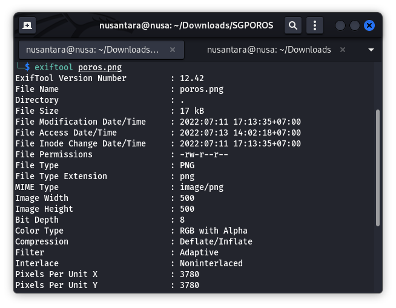
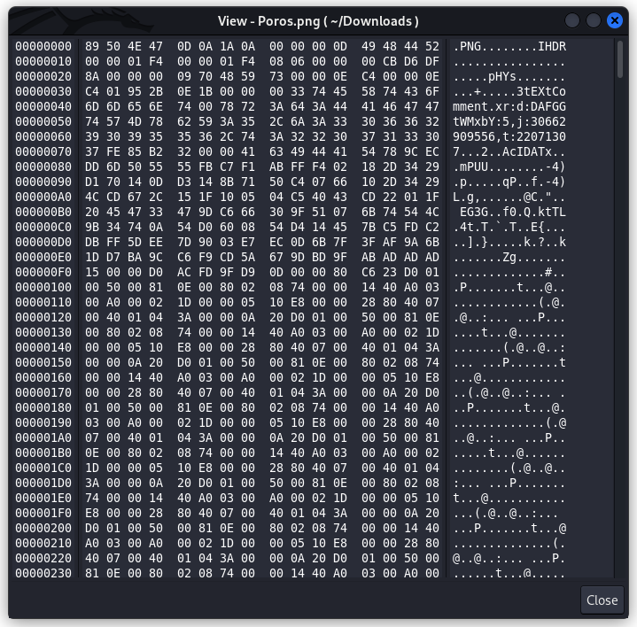
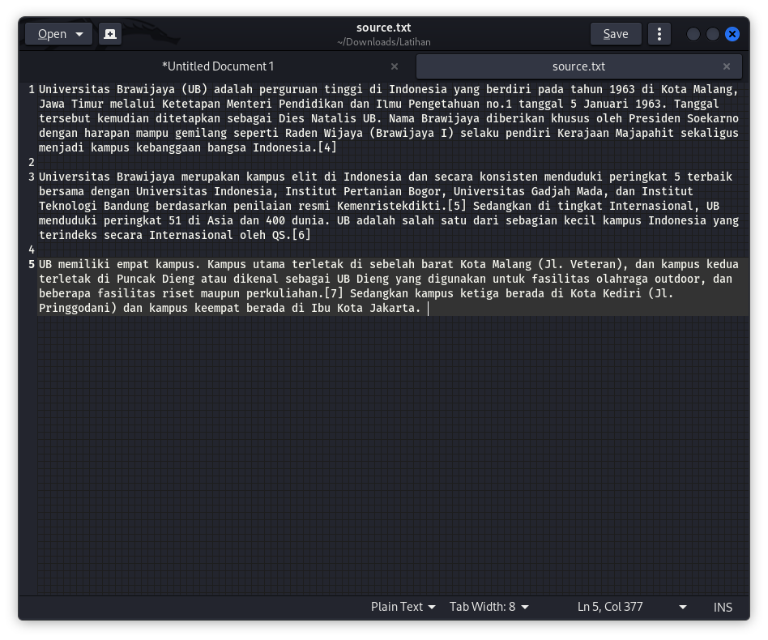
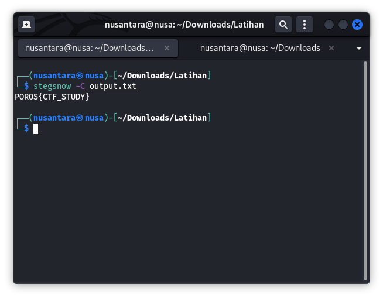

# FORENSIC

*Forensics* dalam arti umum yaitu Forensik (berasal dari bahasa Latin ``forensis`` yang berarti "dari luar", dan serumpun dengan kata ``forum`` yang berarti "tempat umum") adalah bidang ilmu pengetahuan yang digunakan untuk membantu proses penegakan keadilan melalui proses penerapan ilmu atau sains. 

Lalu untuk arti  Forensik Digital, merupakan salah satu cabang ilmu forensic, yang berfokus pada penyelidikan dan penemuan konten perangkat digital, dan seringkali dikaitkan dengan kejahatan computer. Forensic juga merupakan salah satu bidang yang dilombakan pada CTF

## File Format

File format/ file extension  bukan satu-satunya cara untuk mengidentifikasi jenis file, file memiliki byte terkemuka tertentu yang disebut file signature . File juga dapat berisi data "tersembunyi" tambahan yang disebut metadata yang dapat berguna untuk mengetahui informasi tentang konteks data file.

### File Signature 

File signature merupakan deretan kode yang merepresentasikan identitas suatu file. .

Setiap file memiliki file signature yang bermacam-macam. Setiap file yang valid biasanya yang memiliki file signature pada header file (awal file) ,namun ada file tertentu yang juga memiliki file signature pada bagian footer file (akhir file). File Signature biasanya direpresentasikan dengan sistem base-16 atau format heksadesimal. 

### Magic Number

Byte didalam file yang digunakan untuk mengidentifikasi format dari sebuah file. 

Database dari Magic number 
https://ctf101.org/forensics/what-are-file-formats/

## Metadata
metadata merupakan gabungan dari dua kata, yaitu ``meta`` yang berarti deskripsi atau definisi mendasar, dan tentu saja ``data``, yaitu sekumpulan informasi.

Secara singkat, metadata merupakan ringkasan detail mendasar tentang suatu data.

untuk melihat metadata dari suatu file dapat menggunakan perintah

``exiftool namafile.jpg``

### Fungsi Metadata
1. Identifikasi suatu file
2. Melacak dan memantau file 
   
contoh metadata file gambar :

## Stegonagraphy
Steganografi atau Steganography adalah sebuah ilmu, teknik menyembunyikan sebuah pesan rahasia.

Steganografi berasal dari Bahasa Yunani yaitu ``Stegano`` yang berarti “tersembunyi atau menyembunyikan” dan ``graphy`` yang berarti “Tulisan, jadi Steganografi adalah tulisan atau pesan yang disembunyikan.

Contoh steganografi:
1. Menyembunyikan teks dalam suatu gambar 
    - Siapkan suatu gambar 
    - Buka gambar dengan menggunakan hex editor, disini saya menggunakan ``jeex``
    - Untuk menginstall nya dapat menggunakan perintah 
        ``sudo apt install jeex``
    - Setelah menginstall, bisa dibuka lalu buka gambar yang ingin kita sisipkan suatu teks
        tampilan jeex bakal seperti ini,
        
    - Pilih edit lalu masukan teks yang ingin kita sisipkan ke gambar tersebut , setelah pilih option ke ``asci`` lalu klik panah bawah, lalu save as 
    - Untuk mengetahui apakah berhasil, kita bisa melihat ukuran file tersebut , dengan perintah ``ls -l``

        ``rw-r--r-- 1 nusantara nusantara 16895 Jul 13 14:36 Poros2.png``

        ``rw-r--r-- 1 nusantara nusantara 16880 Jul 13 14:31 Poros.png``

    terlihat ukuran file berbeda , jadi bisa disimpulkan bahwa kita berhasil menginput teks kedalam file

2. Menyembunyikan teks didalam file teks
   - Siapkan suatu source.txt
  
     contoh file nya :
     
   - lalu kita buka terminal, disini saya menggunakan tools ``stegsnow``, gunakan perintah ``sudo apt install stegsnow`` untuk menginstall tools nya
   - lalu gunakan perintah ``stegsnow -C -m "POROS{CTF_STUDY}" source.txt output.txt``
  
    kalau berhasil bakal seperti ini

    ``
    Compressed by 14411518807585587200.00%
    Message exceeded available space by approximately 181.48%.
    An extra 4 lines were added.
    ``
   - Apabila kita membuka file tersebut bakal tidak terjadi apa apa , hanya berisikan teks biasa
    Screenshot from 2022-07-13 14-55-25.png)
   - Untuk melihat kata rahasia yang telah kita sisipkan , gunakan perintah ``stegsnow -C output.txt``
    

3. Menyembunyikan file didalam gambar
   - Siapakan file pdf dan juga file gambar
   - Buka terminal, lalu ketikan perintah 
  
        ``cat source.jpg file.pdf > output.jpg``

   - Untuk mengetahui apakah berhasil , kita bandingkan ukuran kedua gambar
  
        ``  rw-r--r-- 1 nusantara nusantara 31305 Jul 13 14:59 output.jpg``

        ``  rw-r--r-- 1 nusantara nusantara 16880 Jul 13 14:31 source.png``

   - Terlihat ukuran gambar berbeda, jadi kita berhasil mengsisipkan suatu file dalam gambar

## Tools/ Command Forensic

- ``cat``
  
  Perintah ini digunakan untuk menampilkan daftar konten atau isi file pada standard output.

- ``xxd`` 

  Perintah  untuk melihat /menampilkan nilai heksadesimal dari suatu file.

- ``binwalk``

  Binwalk adalah alat untuk mencari gambar biner yang diberikan untuk file yang disematkan dan kode yang dapat dieksekusi. Secara khusus, dirancang untuk mengidentifikasi file dan kode yang tertanam di dalam suatu file.

- ``foremost``

  Foremost adalah program  untuk pemulihan file yang bekerja dengan cara mempelajari headers, footers, dan struktur internal data dari file / berkas dimana di dalam dunia forensik  dikenal dengan istilah data carving.

- ``exiftool``

  ExifTool adalah program untuk melihat metadata suatu file.

``exiftool -overwrite_original Creator=Author "contoh.pdf"``

  Digunakan untuk mengedit isi metadata Creator
    

